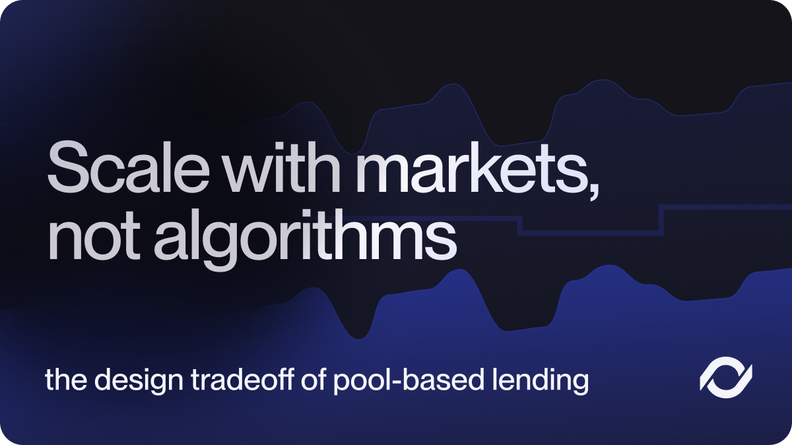
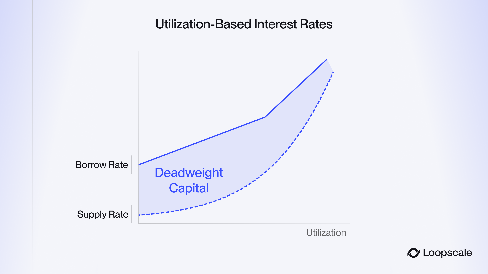
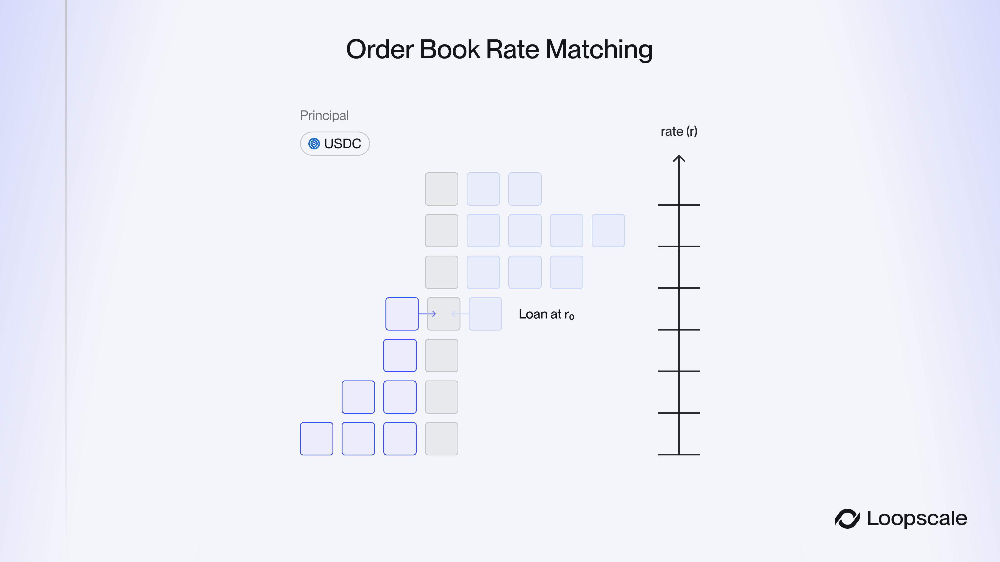

<!-- truncate -->

# Pool-based DeFi lending is inefficient by design. Here’s how Loopscale fixes it.

DeFi lending has long been defined by the capital-inefficient pool model. Market maturity is exposing the limitations of this model, which emerged from Ethereum's architectural constraints. With unprecedented capital flows into the ecosystem, we need lending infrastructure that matches the sophistication of modern finance. Loopscale is that infrastructure.

Welcome to our series on how Loopscale is building better lending on Solana.

## The problem with pools
It’s a common belief that the difference in lend and borrow rates in pools is a fee charged by the protocol. In reality, this spread only reflects the cost of poor protocol design.

Pool-based lending protocols set interest rates based on utilization, i.e. how much of the pool liquidity is currently borrowed. As utilization increases, rates rise to incentivize repayment and attract new deposits. And as utilization decreases, rates fall to attract more borrowers.

This design incentivizes a balance between supplied and borrowed capital while also ensuring sufficient excess liquidity for withdrawals.

The elephant in the room? An inherent spread between lend and borrow rates.

Borrowers might pay 10% while lenders only earn 8%, because borrow interest is paid on borrowed assets but distributed across the entire supply—both active and idle liquidity.

While the lending protocols of today have contributed much to the success of the DeFi ecosystem, the time is now for Lending 2.0. Built on Solana, Loopscale is not hindered by previous technical limitations and can build onchain order books with the scalability, capital-efficiency, and speed needed for the next era of the crypto economy.

## A new model: Atomic Markets
Loopscale introduces a new market structure to onchain lending, combining the best of order books and pools. Each market is atomic—defined by specific terms, collateral types, and rates.

On Loopscale, lenders set rates per-collateral and per-principal, unlike pool models where protocol-set, algorithmic rates apply uniformly. For example, borrowing USDC against USDT collateral should be cheaper than against SOL (as it is on Loopscale), but pool models charge the same rate regardless of collateral quality.

**This means, for the first time in onchain lending, the lend rate equals the borrow rate**. Loopscale’s protocol design eliminates the idle capital requirements that dilute returns. Rates emerge from the market rather than from deterministic algorithms.

Atomic Markets also offer advantages in risk management and collateral flexibility. Lenders benefit from being able to price risk on a per-asset basis. They can also choose to accept only certain collateral, taking on only the risk of their choice.

While pool models are constrained by the riskiest included asset, Atomic Markets have the granular risk pricing controls necessary to support any asset. Higher-risk collateral will command higher rates and lower LTVs, while established assets will find more competitive terms.

New assets don’t need deep pool liquidity, just willing counterparties to create a market. This enables markets for novel and emerging asset classes underserved by traditional DeFi lending markets. **If there are lenders and borrowers, there is a market**.

## Common concerns — and how we address them
The shift to order book lending raises two key challenges: unutilized capital and liquidity fragmentation.

For unutilized capital waiting to be matched on the order book, we've implemented Optimized Yield. Optimized Yield automatically routes any unutilized liquidity to integrated pool lending protocols, ensuring lenders earn competitive yields until their orders are filled.

As for liquidity fragmentation, we've solved this with Virtual Liquidity. This is an abstraction that 1) enables lenders to place orders that span multiple markets with a single capital commitment and 2) offers borrowers an aggregated view of this multi-parameter liquidity while maintaining atomic settlement.  

## Why now?
Using order books has been impractical until now due to high gas costs and computational constraints. Solana’s architecture fundamentally changes this. Its low transaction costs and high throughput make sophisticated market structures viable at scale. With Solana, Loopscale can implement abstractions like Virtual Liquidity that accomplish the user experience of pool models without compromising on scalability.

The rise of yield-bearing assets—from AMM LP positions to JLP and LSTs—creates an unignorable demand for Atomic Markets. Loopscale unlocks liquidity for these specialized assets that are poorly served by pool models.

## Lending and beyond
Order books deliver not just capital efficiency but also the flexibility that modern lending markets require.

Atomic Markets support fixed rates, custom repayment schedules, complex collateral types, and sophisticated lending strategies that are impossible with the rigid pool model.

As DeFi matures, this functionality will prove to be critical. Structured products and risk controls are a prerequisite for institutional capital to arrive onchain.

Order books and Atomic Markets are DeFi’s key to scale. **It’s time to accelerate**.
